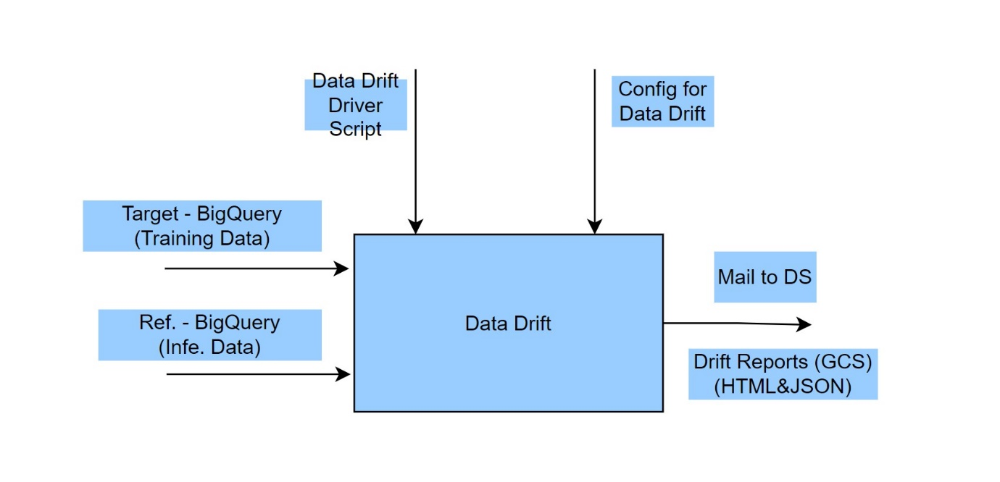
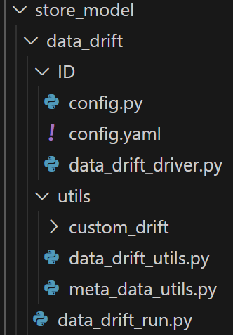
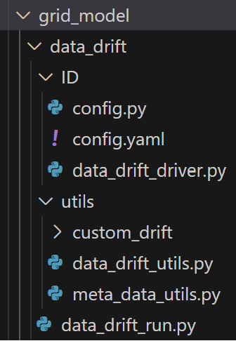
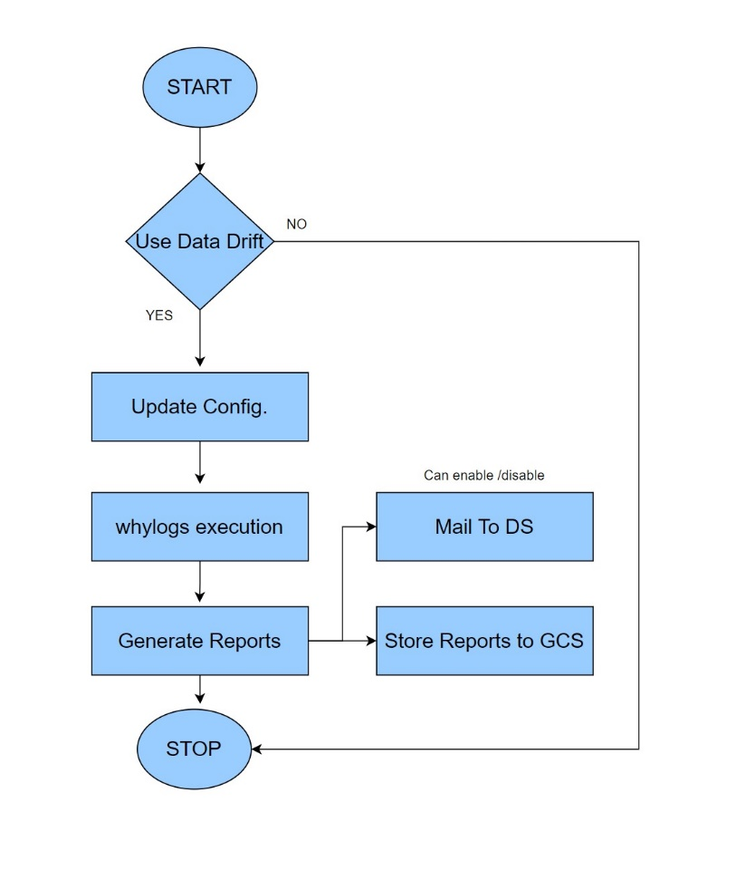
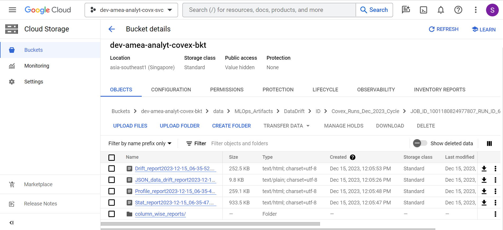
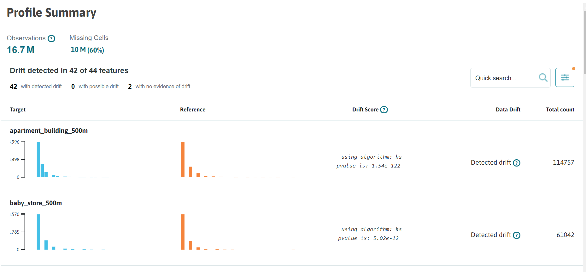
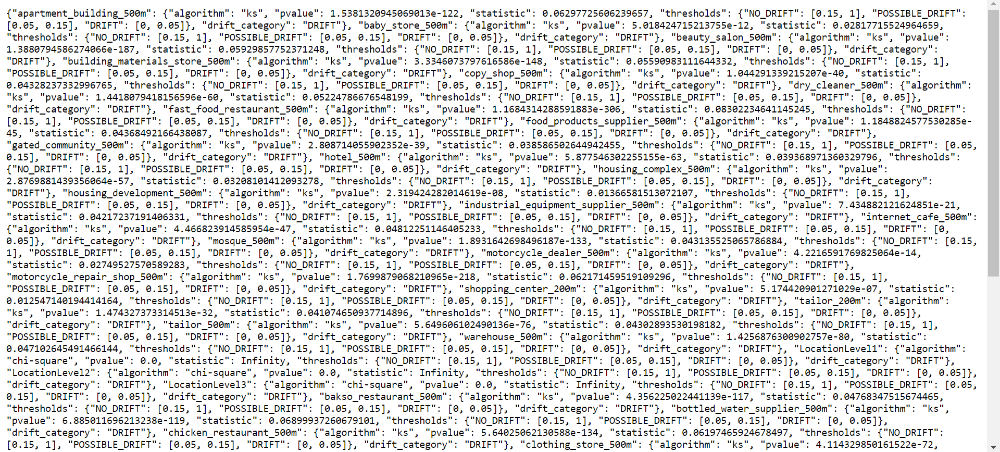
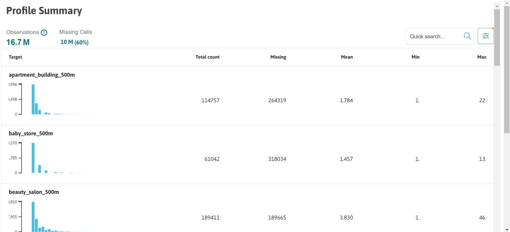

Data Drift (Covex)

Intended Audience

- Data Science Professional

- Machine Learning Engineer

- Data Engineer

- Technical Business Analyst

Overview

Introduction to Data drift and its benefits

Data drift refers to the phenomenon where the statistical properties of
the input data used for machine learning models change over time.
Monitoring and addressing data drift is crucial for maintaining the
accuracy and reliability of models in production. The Data Drift
Documentation provides a systematic approach to understand, detect, and
mitigate data drift in machine learning systems.

There are several factors that can contribute to data drift, including:

- Seasonal Changes: Data distributions may vary due to seasonal
  patterns, such as weather, holidays, or consumer behaviour, leading to
  shifts in feature values.

- Instrumentation Changes: Updates or changes in data collection
  methods, sensors, or measurement tools can introduce variations in the
  data, affecting its statistical properties.

- Population Drift: Changes in the target population or user base can
  lead to shifts in the data distribution, especially if the model was
  trained on a different population.

- Concept Drift: The underlying concepts or relationships between
  features and the target variable may change over time, causing data
  distributions to deviate from the training data.

- Data Collection Bias: Biases introduced during data collection, such
  as sampling bias or label bias, can result in data drift when deployed
  in real-world scenarios.

- System Changes: Updates or modifications to the system infrastructure,
  data preprocessing pipelines, or data storage mechanisms can introduce
  unintended changes to the data.

Benefits of Data Drift Component

- Monitoring Data Distribution: It allows data scientists to
  continuously monitor the statistical characteristics of the input data
  used by the model. This includes tracking changes in feature
  distributions, data quality, and other relevant metrics.

- Early Detection of Data Drift: By comparing the current data
  distribution with the baseline or reference distribution, the data
  drift component enables early detection of data drift. This helps in
  identifying shifts, trends, or anomalies that may impact the model’s
  performance.

- Model Performance Evaluation: The data drift component assists in
  assessing the impact of data drift on the model’s performance. By
  analyzing performance metrics, such as accuracy, precision, and
  recall, data scientists can understand how data drift affects model
  predictions.

- Documentation and Reporting: The data drift component facilitates
  thorough documentation and reporting of data drift observations,
  analysis, and actions taken. This ensures transparency,
  reproducibility, and effective communication among data science teams
  and stakeholders.

Tools for Detecting Data Drift

- Evidently: Evidently is a tool that can be integrated with MLflow to
  monitor data drift. It provides a comprehensive set of metrics and
  visualizations to assess the changes in data distribution over time
  and detect data drift in machine learning models.

- WhyLogs: WhyLogs, when integrated with MLflow, enables real-time
  monitoring of data pipelines and helps detect data drift. It utilizes
  probabilistic data structures to collect summary statistics and
  metadata about the data as it is processed, facilitating the
  identification of shifts in data distribution.

- PyCaret: PyCaret, integrated with MLflow, offers capabilities for
  monitoring data drift and model performance. It includes outlier
  detection and drift analysis features, along with model training,
  tuning, and deployment functionalities. PyCaret utilizes the Evidently
  library to generate reports and insights.

Code Repository

| Resource Type   | Details                                                            |
|-----------------|--------------------------------------------------------------------|
| Project Name    | Coverage expansion                                                 |
| Codes/Scripts   | mlops/store_model/data_drift/ & mlops/grid_model/data_drift/       |
| Repository Link | https://github.com/mondelez-d4gv/mdlz-d4gv-amea-coverage-expansion |

Component flow

Input: Featured data (biq query tables)

Output: 1. Email notification

2\. Reports (saved in GCS bucket):

- profile report (HTML)

- data drift report (HTML + JSON)

- statistical report (HTML)

Folder Structure in GitHub

Below is the folder structure available for data drift in GitHub
Repository:

Store Model

Grid Model

Data Drift folder contains following sub-components:

- Utils is the static folder used for placing data_drift_utils and
  meta_data_utils which consists of utility functions for data drift and
  can be reused in the driver script.

- Config contains all the data drift component level configurations.

- Custom drift folder is used for placing custom data drift tests
  functions.

- Data drift driver is the entry point for all the scripts, it calls the
  main script ‘data_drift_run.py’ which is responsible for all the
  analysis and storing reports.

Functional flow

Component outcome

References

- <https://docs.whylabs.ai/docs/>

- [<u>https://whylabs.ai/blog/posts/data-logging-with-whylogs</u>](https://whylabs.ai/blog/posts/data-logging-with-whylogs)
