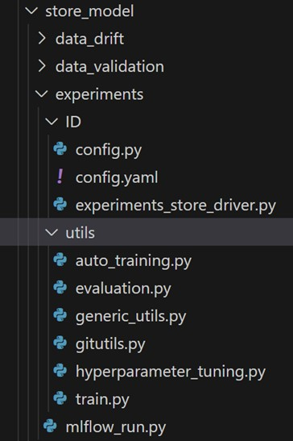
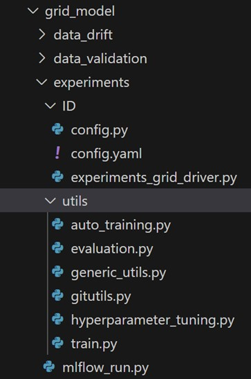

# Model Experiments (Covex)

Intended Audience

- Data Science Professional

- Machine Learning Engineer

- Data Engineer

- Technical Business Analyst

Overview

### Introduction to MLFlow experiment tracking

MLflow experiment tracking is a feature of the MLflow platform that
enables data scientists to track and compare their machine learning
experiments. It provides a centralized location for storing experiment
runs and their associated metadata, such as the code, data, and
configurations used in the experiment. With MLflow experiment tracking,
data scientists can:

- **Record and compare experiments:** MLflow allows data scientists to
  log experiment runs, including the parameters, metrics, and artifacts
  generated during the experiment. This makes it easy to compare
  experiments and track progress over time.

- **Reproduce results:** MLflow allows data scientists to easily
  reproduce experiments by recording the environment, code, and data
  used during the experiment. This makes it easier to debug issues and
  verify results.

- **Collaborate with others:** MLflow provides a centralized location
  for storing and sharing experiments, making it easy for data
  scientists to collaborate and share their work with others.

- **Visualize experiment results:** MLflow provides tools for
  visualizing experiment results, including graphs and charts that make
  it easy to compare metrics and track progress over time.

Benefits of Model Experiments Component

- MLflow allows you to version your models, making it easy to track
  changes over time and roll back to previous versions if needed.

- MLflow can automatically log key parameters and metrics during the
  model training process, saving time and reducing the chance of human
  error in manually tracking these values.

- MLflow facilitates the deployment of models to various platforms,
  helping you transition from experimentation to production seamlessly.

- MLflow integrates with tools like Hyperopt and Optuna for
  hyperparameter tuning, making it easier to search and optimize the
  hyperparameter space.

Code Repository

| Resource Type   | Details                                                            |
|-----------------|--------------------------------------------------------------------|
| Project Name    | Coverage expansion                                                 |
| Codes/Scripts   | mlops/store_model/experiments/ & mlops/grid_model/experiments/     |
| Repository Link | https://github.com/mondelez-d4gv/mdlz-d4gv-amea-coverage-expansion |

Component flow

Folder Structure in GitHub

Below is the folder structure available for model experiments in GitHub
Repository:

Store Model

Grid Model

- Experiments folder contains following sub-components:

- Utils is the static folder used for placing auto_training, evaluation,
  generic_utils, gitutils, hyperparameter_tuning, train scripts which
  consists of utility functions for experiments and can be reused in the
  driver script.

- Config contains all the experiment component level configurations.

- experiments_grid_driver is the entry point for all the scripts, it
  calls the main script ‘mlflow_run.py’ which is responsible for
  creating experiments leveraging mlflow.

Function flow

Component outcome

After experiment has finished running, user can view and analyse the
experiment results in the Databricks UI in "Experiments". Please refer
to snapshot below for reference.

## References

## <https://docs.databricks.com/mlflow/tracking.html>
