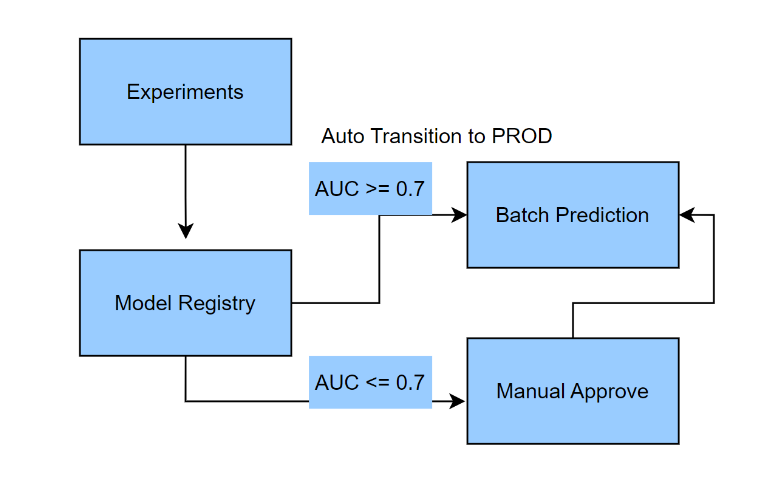
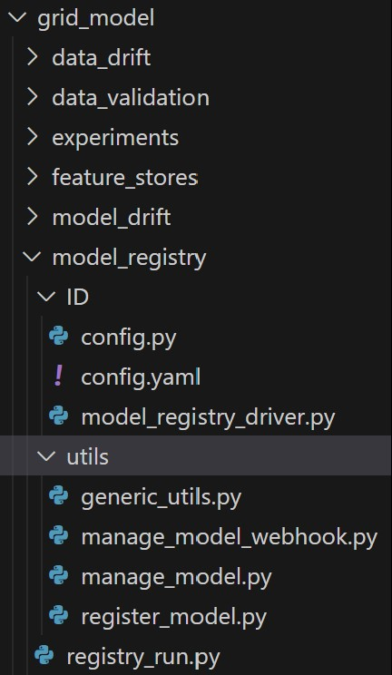
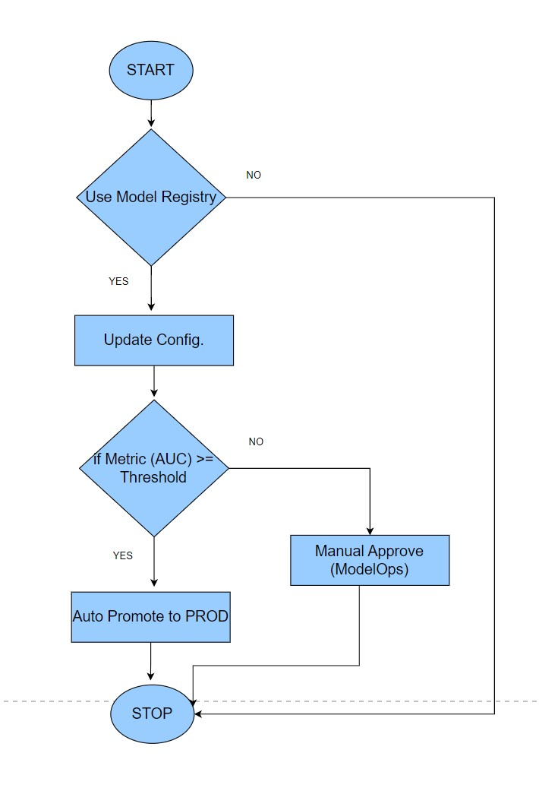
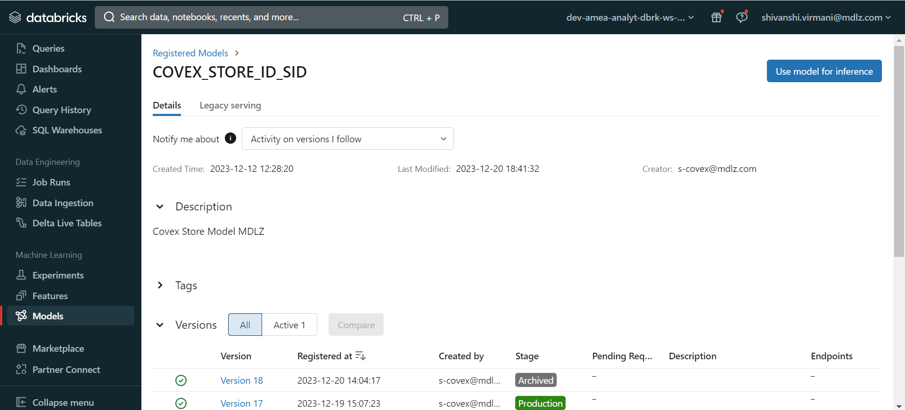

# Model Registry (Covex)

Intended Audience

- Data Science Professional

- Machine Learning Engineer

- Data Engineer

- Technical Business Analyst

Overview

### Introduction to Model Registry

Databricks provides a centralized repository and management system for
ML models called as model registry. It acts as a feature where you can
store, version, stages, logs, artifacts and organize your ML models. The
Model Registry is designed to help data scientists and machine learning
(ML) engineers manage and organize their ML models throughout their
lifecycle. By using the Model Registry, you can establish a structured
and organized approach to managing your ML models, ensuring
reproducibility, collaboration, and scalability throughout the model
development process.

Model registry provides the following benefits:

- **Model versioning and Tracking:** The Model Registry allows you to
  track different versions of a model, making it easy to compare and
  manage model iterations. This feature enables teams to keep track of
  changes and improvements made to the models over time.

- **Model Staging and Promotion:** You can create different stages
  (e.g., "Dev," "Test," "Production") in the Model Registry to manage
  the model deployment process. Models can be promoted from one stage to
  another, ensuring a controlled and standardized deployment workflow.

- **Model Governance:** Will help to support governance policies and
  ensures regulatory compliance.

- **Model Approval Workflow:** The Model Registry provides an approval
  process, allowing designated stakeholders to review and approve model
  versions before they are promoted to production. This ensures that
  only validated and high-quality models are deployed.

- **Model Deployment and Monitoring:** The Model Registry integrates
  with Databricks deployment tools, making it easy to deploy models to
  various target environments, such as batch scoring or real-time
  serving. Additionally, it provides monitoring capabilities to track
  the performance and drift of deployed models.

- **Dependent components:** Components like model serving, model drift,
  XAI, model comparison use the model registry for their execution.

Code Repository

| Resource Type   | Details                                                              |
|-----------------|----------------------------------------------------------------------|
| Project Name    | Coverage expansion                                                   |
| Codes/Scripts   | mlops/store_model/model_registry/ & mlops/grid_model/model_registry/ |
| Repository Link | https://github.com/mondelez-d4gv/mdlz-d4gv-amea-coverage-expansion   |

Component flow

Folder Structure in GitHub

Below is the folder structure available for model registry in GitHub
Repository:

Store Model

Grid Model

Model Registry folder contains following sub-components:

- Utils is the static folder used for placing generic_utils,
  manage_model, register_model scripts which consists of utility
  functions for model registry and can be reused in the driver script.

- Config contains all the registry component level configurations.

- Model_registry_driver is the entry point for all the scripts, it calls
  the main script ‘registry_run.py’ which is responsible for registering
  finalized model leveraging mlflow.

Function flow

Component outcome

## References

- <https://docs.databricks.com/mlflow/model-registry.html>
