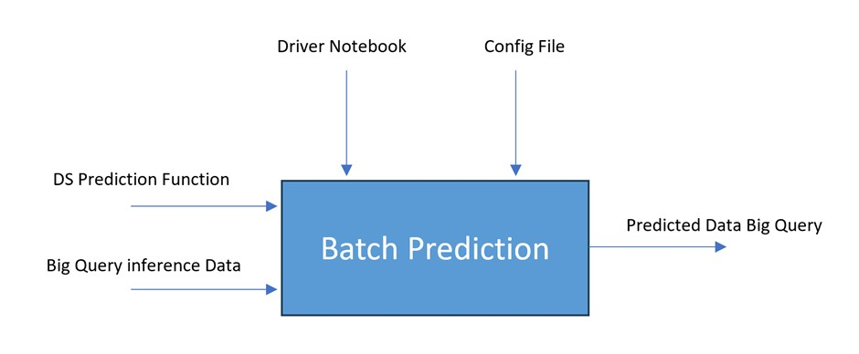
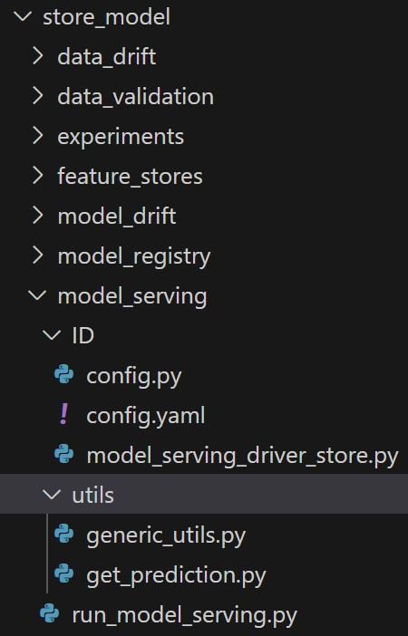
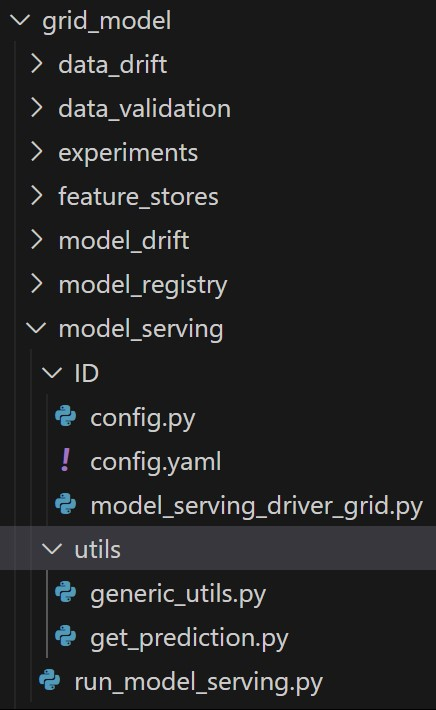
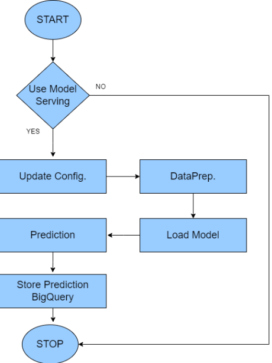
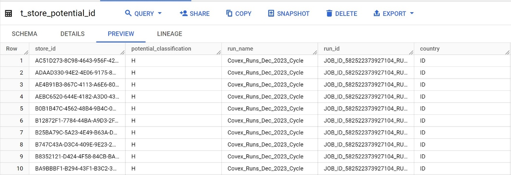

# Model Serving (Covex)

Intended Audience

- Data Science Professional

- Machine Learning Engineer

- Data Engineer

- Technical Business Analyst

Overview

### Introduction to Model Serving

Model Batch Serving component allows data scientists and developers to
deploy and serve machine learning models at scale. It enables you to
serve pre-trained models to make predictions on new data in batch mode,
as opposed to real-time serving. Model Batch serving provides the
following benefits:

- **Offline Predictions:** Batch serving is particularly useful for
  performing offline predictions on historical data, enabling batch
  inference on large datasets that might not be feasible in real-time.

- **Scalable model deployment:** This allows you to deploy machine
  learning models in batch mode, which is ideal for scenarios where you
  need to process large volumes of data in a scheduled or on-demand
  manner.

- **Reusable models:** Once you've trained and registered a model in
  registry, you can easily deploy it for batch serving multiple times,
  without retraining the model every time.

- **Seamless integration:** Model Batch Serving can be integrated with
  other MLOps components, such as experiment tracking and model
  registry, to streamline the end-to-end machine learning lifecycle.

Code Repository

| Resource Type   | Details                                                            |
|-----------------|--------------------------------------------------------------------|
| Project Name    | Coverage expansion                                                 |
| Codes/Scripts   | mlops/store_model/model_serving/ & mlops/grid_model/model_serving/ |
| Repository Link | https://github.com/mondelez-d4gv/mdlz-d4gv-amea-coverage-expansion |

Component flow

Folder Structure in GitHub

Below is the folder structure available for model serving in GitHub
Repository:

Store Model

Grid Model

Model Serving folder contains following sub-components:

- Utils is the static folder used for placing generic_utils,
  get_prediction scripts which consists of utility functions for model
  serving and can be reused in the driver script.

- Config contains all the model serving component level configurations.

- Model_serving_driver_grid/ Model_serving_driver_store is the entry
  point for all the scripts, it calls the main script
  ‘run_model_serving.py’ which is responsible for creating prediction
  tables in Big Query.

Functional flow

Component outcome

Below are the snapshots for predicted tables for one of the models in
Big Query:

## References

- <https://mlflow.org/docs/latest/models.html>
