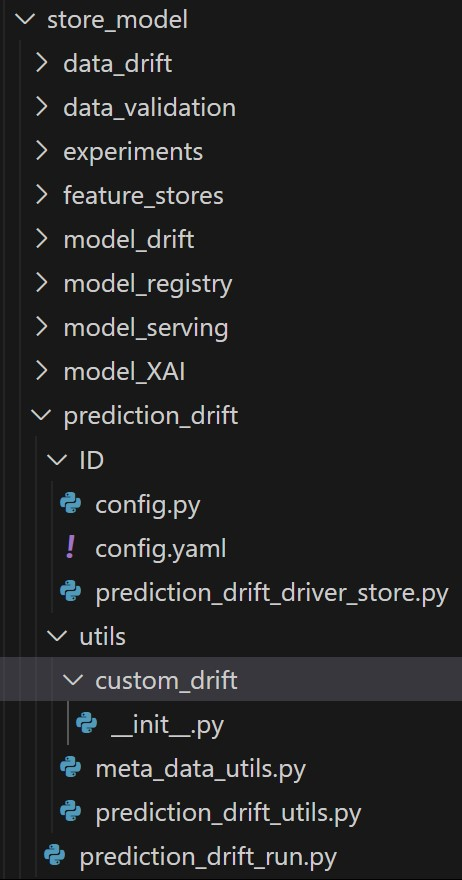

# Prediction Drift (Covex)

Intended Audience

- Data Science Professional

- Machine Learning Engineer

- Data Engineer

- Technical Business Analyst

Overview

### Introduction to Prediction Drift

The prediction drift monitoring component is designed to track changes
in the model's predictions over time. It involves comparing the
predictions made in previous cycle with the predictions in the current
cycle. The component logs predictions from each model cycle, including
timestamps and relevant metadata. This logged information is crucial for
retrospective analysis and model performance evaluation.

This component provides the following benefits:

- **Early Detection of Model Degradation:** By comparing predictions
  across different model cycles, prediction drift monitoring helps in
  early detection of potential issues or degradation in model
  performance. This proactive approach allows for timely interventions.

- **Model Maintenance and Adaptation:** Drift monitoring provides
  insights into when the model might be losing effectiveness due to
  changes in the underlying data patterns. This information guides
  decisions on when to update the model to maintain its accuracy and
  relevance.

- **Enhanced Model Robustness**: Regularly monitoring prediction drift
  contributes to the robustness of machine learning models. By adapting
  to changing data patterns, models become more resilient to variations
  in input features and maintain their predictive power.

- **Operational Efficiency:** Efficiently managing model performance
  over time reduces the risk of using outdated or suboptimal models in
  production. This leads to improved operational efficiency and ensures
  that models continue to meet performance expectations.

Code Repository

| Resource Type   | Details                                                                   |
|-----------------|---------------------------------------------------------------------------|
| Project Name    | Coverage expansion                                                        |
| Codes/Scripts   | mlops/store_model/prediction_drift/ & mlops/grid_model/ prediction_drift/ |
| Repository Link | https://github.com/mondelez-d4gv/mdlz-d4gv-amea-coverage-expansion        |

Component flow

Folder Structure in GitHub

Below is the folder structure available for prediction drift in GitHub
Repository:

Store Model

Grid Model

Prediction drift folder contains following sub-components:

- Utils is the static folder used for placing prediction_drift_utils,
  meta_data_utils scripts which consists of utility functions for
  experiments and can be reused in the driver script.

- Config contains all the prediction drift component level
  configurations.

- prediction_drift_driver_store/ prediction_drift_driver_grid is the
  entry point for all the scripts, it calls the main script
  ‘prediction_drift_run.py’ which is responsible for creating prediction
  drift reports.

Functional flow

Component outcome

References

- <https://docs.whylabs.ai/docs/>

- [<u>https://whylabs.ai/blog/posts/data-logging-with-whylogs</u>](https://whylabs.ai/blog/posts/data-logging-with-whylogs)
